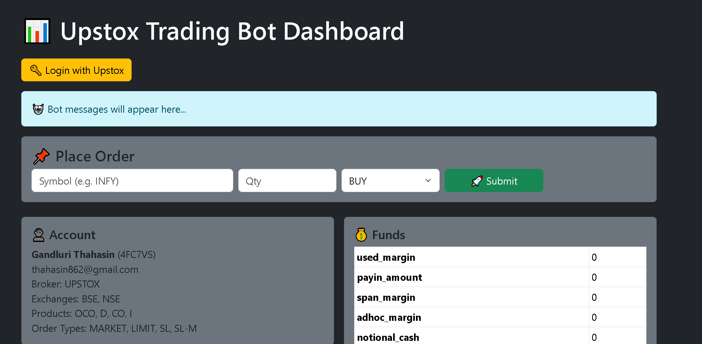

# 📊 Trading Bot (Upstox API + Flask)

This project is a **full-stack trading bot** built using **Python (Flask)**, **Upstox API (v2)**, and a **real-time web dashboard**.  
It provides a user-friendly interface to **monitor portfolio, funds, positions, orders, and trades** while also supporting **automated order placement**.  
The bot includes **secure authentication**, **refresh token handling**, and **live trade updates** for uninterrupted trading.  

---

## 🚀 Features
- 🔑 **Secure Login** with Upstox API (OAuth2)
- 💰 View **funds and margins**
- 📌 Track **positions & holdings**
- 📝 View **order history** and **trades**
- ⚡ **Place Buy/Sell orders** directly from the dashboard
- 🔄 **Auto refresh token** for uninterrupted access
- 📊 Live updates with **Server-Sent Events (SSE)**

---

## 🛠️ Tech Stack
- **Python 3.10+**
- **Flask** (backend framework)
- **Upstox API v2**
- **JavaScript (Vanilla + Bootstrap)** for frontend
- **HTML/CSS** for dashboard design

## 📸 Screenshots

### 🔑 Login Page


### 📊 Dashboard


### 📦 Holdings & Positions
.png)

---

## ⚙️ Setup Instructions
1. Clone the repository:
   ```bash
   git clone https://github.com/thahasin04/Trading_Bot.git
   cd Trading_Bot
